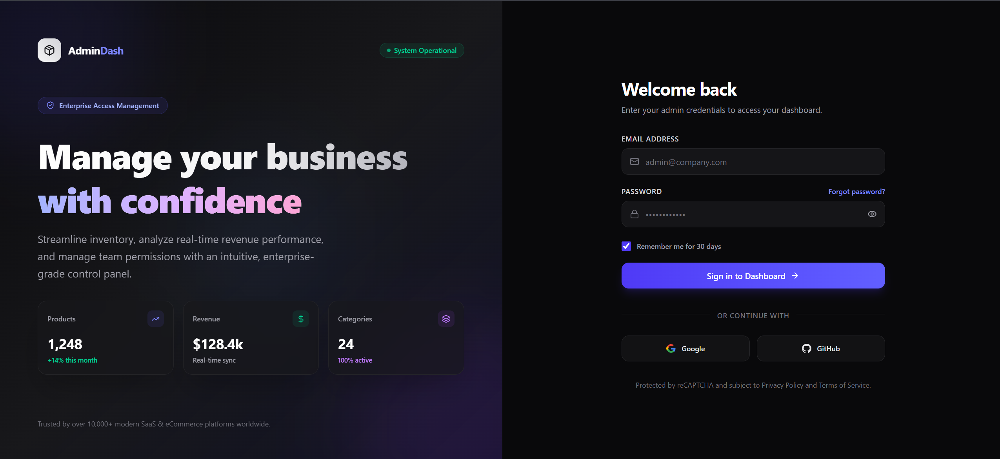
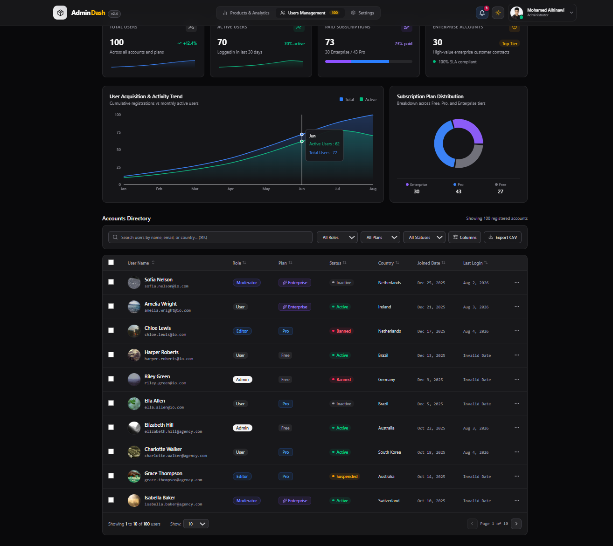
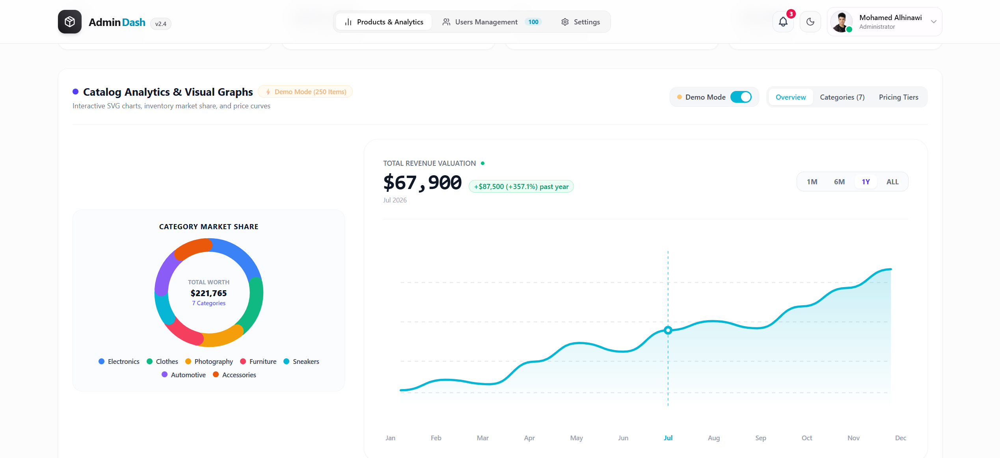
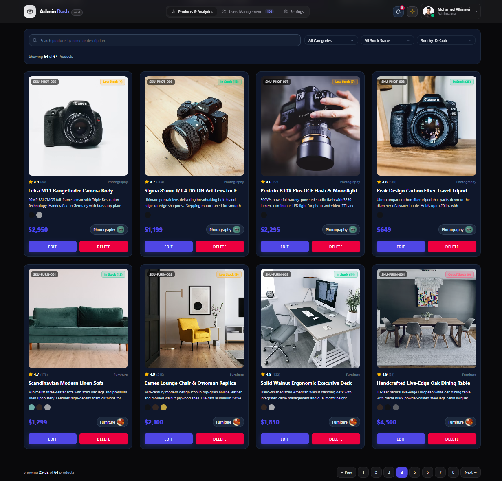
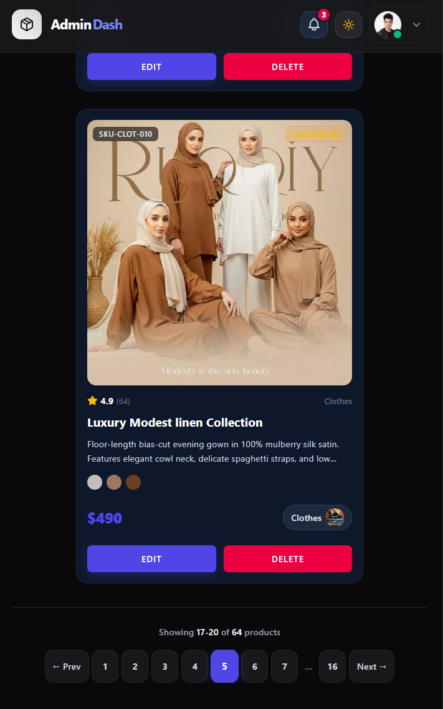

# AdminDash — Enterprise E-Commerce Admin & Analytics Dashboard

[](https://react.dev/)
[](https://www.typescriptlang.org/)
[](https://tailwindcss.com/)
[](https://vitejs.dev/)
[](LICENSE)

An enterprise-grade, high-performance e-commerce admin control panel and catalog management platform. Inspired by the refined design aesthetics of **Stripe**, **Linear**, and **Apple**, **AdminDash** provides real-time inventory insights, interactive category valuation analytics, dynamic demo mode simulations, advanced multi-criteria product filtering, and a smart responsive pagination system.

---

## 📋 Table of Contents

- [Overview](#-overview)
- [Key Features](#-key-features)
- [Product Catalog Architecture](#-product-catalog-architecture)
- [Analytics & Demo Mode Engine](#-analytics--demo-mode-engine)
- [Smart Responsive Pagination System](#-smart-responsive-pagination-system)
- [Tech Stack](#-tech-stack)
- [Project Folder Structure](#-project-folder-structure)
- [Getting Started](#-getting-started)
- [Screenshots & UI Showcase](#-screenshots--ui-showcase)
- [Future Improvements & Roadmap](#-future-improvements--roadmap)
- [License](#-license)

---

## 🌟 Overview

**AdminDash** is designed as a production-ready SaaS administration dashboard for modern e-commerce enterprises. Rather than a basic CRUD demo, it delivers a comprehensive management workflow featuring:

- **Enterprise Product Management**: Full catalog tracking across 64 realistic items with SKUs, stock thresholds, ratings, and color variants.
- **Interactive Analytics Engine**: Real-time KPI tracking, category relative market valuation graphs, inventory share calculations, and pricing tier distribution deep dives.
- **Global Demo Mode**: An instant toggle switch allowing administrators and prospective clients to preview heavy enterprise workload simulations without altering visual brand identities.
- **Adaptive Dark Design System**: Glassmorphism surfaces, subtle ambient micro-animations, and Tailwind CSS v4 variables.

---

## ✨ Key Features

- **🔒 Split-Column Authentication Page**: Premium dark-mode login experience with animated statistics cards, password visibility toggles, and social login integrations.
- **📦 Enterprise Product Catalog**: 64 pre-configured items with complete metadata (SKU, price, stock, ratings, reviews, color swatches).
- **🔎 Multi-Field Search**: Real-time filtering across titles, descriptions, and SKUs with instant query highlight reset.
- **🏷️ Category & Stock Status Filtering**: Filter by 7 standardized categories or stock state (`In Stock`, `Low Stock`, `Out of Stock`).
- **⚡ Advanced Sorting**: Sort catalog by `Price: Low to High`, `Price: High to Low`, `Newest Arrival`, `Highest Rated`, or `Title: A to Z`.
- **📱 Smart Responsive Pagination**: Custom pagination algorithm supporting full page displays on desktop and smart ellipsis collapsing on mobile devices.
- **📊 Interactive Analytics Dashboard**: Category relative valuation bar charts, donut distribution graphs, and 4-tier pricing breakdown.
- **🧪 Global Demo Mode Toggle**: Instantly swaps live catalog numbers with realistic 250-item mock distributions while preserving visual category colors, icons, and layout structure.
- **👥 User Management Table**: TanStack Table v8 integration featuring multi-column sorting, visibility controls, row selection, role filtering, and CSV export capabilities.

---

## 📦 Product Catalog Architecture

The catalog contains **64 realistic products** balanced across **7 standardized categories**:

| Category        | Product Count |   Price Range    |    Accent Color     |
| :-------------- | :-----------: | :--------------: | :-----------------: |
| **Electronics** |   10 Items    |  $300 – $2,500   |  Blue (`#2563eb`)   |
| **Clothes**     |   10 Items    |    $50 – $500    | Emerald (`#10b981`) |
| **Photography** |    8 Items    |  $500 – $3,000   |  Amber (`#f59e0b`)  |
| **Furniture**   |    8 Items    |  $400 – $6,000   |  Rose (`#f43f5e`)   |
| **Sneakers**    |    8 Items    |   $100 – $500    |  Cyan (`#06b6d4`)   |
| **Automotive**  |   10 Items    | $5,000 – $30,000 | Purple (`#8b5cf6`)  |
| **Accessories** |   10 Items    |  $100 – $2,000   | Orange (`#ea580c`)  |

### Product Data Model (`Product` Interface)

Every product object in the system strictly adheres to the following TypeScript interface:

```typescript
export interface Product {
  id?: string;
  title: string;
  description: string;
  imageURL: string;
  price: string;
  colors: string[];
  stock?: number;
  sku?: string;
  rating?: number;
  reviewCount?: number;
  createdAt?: string;
  category: {
    name: string;
    imageURL: string;
  };
}
```

---

## 📊 Analytics & Demo Mode Engine

The **Analytics Section** provides instant quantitative visibility into inventory valuation, category distribution, and pricing tier demographics.

```
┌────────────────────────────────────────────────────────────────────────┐
│                        Analytics Header                               │
│  [ Overview ]  [ Categories ]  [ Pricing Tiers ]  ─── [ Demo Mode ON ] │
└────────────────────────────────────────────────────────────────────────┘
```

### Analytics Views

1. **Overview Tab**: Live KPI summary cards displaying total products, combined inventory valuation, average product price, and total category count.
2. **Categories Tab**: Visual relative market valuation comparison graph alongside interactive SVG donut chart and category cards.
3. **Pricing Tiers Tab**: Breakdown across four market segments:
   - **Budget Tier** ($0 – $150)
   - **Mid-Tier** ($151 – $500)
   - **High-Tier** ($501 – $2,000)
   - **Ultra Tier** ($2,001+)

### Demo Mode Rules

When **Demo Mode** is toggled **ON**:

- Analytics values dynamically calculate against a **250-item enterprise dataset**.
- Bar charts, donut progress bars, inventory shares, and pricing tier cards adjust in real time.
- **Single Source of Truth (`CATEGORY_CONFIG`)** guarantees that category names, icons, gradients, accent colors, and component layouts **NEVER** shift or break visual identity.

---

## 📱 Smart Responsive Pagination System

To maintain seamless touch interaction across all viewport sizes, **AdminDash** implements a custom responsive pagination algorithm:

### Viewport Behavior

- **Desktop (≥1024px)**: Full pagination displaying 8 items per page without collapsing (`1 2 3 4 5 6 7 8`).
- **Tablet (640px – 1023px)**: Balanced 6 items per page with compact controls.
- **Mobile (<640px)**: Smart ellipsis algorithm showing 4 items per page:
  - Always shows the **first page** (`1`).
  - Always shows the **last page** (`totalPages`).
  - Always shows the **current page** (`currentPage`).
  - Displays **two pages before** and **two pages after** the active page.
  - Replaces non-adjacent hidden pages with smart ellipsis (`...`).

### Mobile Pagination Example

```txt
Page 3 of 16:   ← Prev   1 2 [3] 4 5 ... 16   Next →
Page 8 of 16:   ← Prev   1 ... 6 7 [8] 9 10 ... 16   Next →
Page 13 of 16:  ← Prev   1 ... 11 12 [13] 14 15 16   Next →
```

### Usability Rules

- **No Horizontal Overflow**: Enforces single-line `flex-nowrap` layouts.
- **Touch Standard**: Minimum 44px × 44px tap target area for mobile buttons.

---

## 🧰 Tech Stack

- **Core**: [React 19](https://react.dev/), [TypeScript 5.8](https://www.typescriptlang.org/), [Vite 6](https://vitejs.dev/)
- **Styling**: [Tailwind CSS v4](https://tailwindcss.com/) (using native CSS variables `utility-(--custom-property)`), Vanilla CSS
- **Component Primitives**: [Headless UI](https://headlessui.com/), [shadcn/ui](https://ui.shadcn.com/)
- **Data Tables**: [TanStack Table v8](https://tanstack.com/table/v8)
- **Icons & Visuals**: [Lucide React](https://lucide.dev/), [Heroicons](https://heroicons.com/)
- **Form Validation**: [Zod](https://zod.dev/), [React Hook Form](https://react-hook-form.com/)
- **Utilities**: `uuid`, `clsx`, `tailwind-merge`

---

## 🗂️ Project Folder Structure

```txt
AdminDash/
├── src/
│   ├── assets/             # Local images, SVG illustrations, and static assets
│   ├── components/         # Reusable dashboard components
│   │   ├── ui/             # Core design system primitives (Button, Input, Select, Modal, Toast)
│   │   ├── users/          # TanStack User Management table and form modal
│   │   ├── AnalyticsCharts.tsx
│   │   ├── FilterBar.tsx
│   │   ├── Footer.tsx
│   │   ├── Header.tsx
│   │   ├── Hero.tsx
│   │   ├── KpiStats.tsx
│   │   └── ProductCard.tsx
│   ├── data/               # Product catalog, categories, and mock datasets
│   ├── hooks/              # Custom React hooks (useDarkMode, useTableState)
│   ├── interfaces/         # TypeScript interfaces and domain schemas
│   ├── pages/              # Top-level view router pages
│   │   ├── login/          # Dark-mode split-column LoginPage
│   │   └── users/          # Users management page
│   ├── schema/             # Zod validation schemas
│   ├── types/              # Utility types
│   ├── App.tsx             # Main dashboard view controller & router
│   ├── index.css           # Tailwind v4 entry and global styles
│   └── main.tsx            # Application entry point
├── public/                 # Static web assets
├── index.html              # HTML5 template
├── package.json            # Project dependencies & scripts
├── tsconfig.json           # TypeScript configuration
└── vite.config.ts          # Vite build configuration
```

---

## 🚀 Getting Started

### Prerequisites

Ensure you have **Node.js** (v18.0.0 or higher) installed on your machine.

### Installation

1. **Clone the repository**:

   ```bash
   git clone https://github.com/alhinawi/e-commerce.git
   cd AdminDash
   ```

2. **Install dependencies**:

   ```bash
   npm install
   # or
   pnpm install
   ```

3. **Start the development server**:
   ```bash
   npm run dev
   ```
   _The application will launch locally on [http://localhost:5173](http://localhost:5173)._

### Production Build & Preview

To generate a production-ready bundle and test it locally:

```bash
# Build the production application
npm run build

# Preview the build output
npm run preview
```

---

## 📸 Screenshots & UI Showcase

| View                             | Screenshot Preview                                                                           |
| :------------------------------- | :------------------------------------------------------------------------------------------- |
| **Authentication Page**          |                                              |
| **Dashboard Overview**           |                              |
| **Analytics & Valuation Charts** |                                  |
| **Product Catalog Grid**         |                                        |
| **Mobile Smart Pagination**      |                                |

---

## 🔮 Future Improvements & Roadmap

- [ ] **Backend API Integration**: Connect product management forms with REST / GraphQL backend APIs.
- [ ] **Database Integration**: Add persistent database integration via Prisma & PostgreSQL.
- [ ] **Role-Based Access Control (RBAC)**: Fine-grained permissions for Admin, Manager, and Viewer roles.
- [ ] **Real-time Notifications**: WebSockets-driven live activity stream for inventory changes.
- [ ] **CSV / PDF Export**: One-click catalog export and inventory audit reports.
- [ ] **Light Theme Toggle**: Seamless light/dark theme switching mode.
- [ ] **Internationalization (i18n)**: Multi-language support (English, Arabic, Spanish).

---

## 📄 License

Distributed under the MIT License. See `LICENSE` for more information.

---

<div align="center">
  <sub>Built with ❤️ using React, TypeScript, and Tailwind CSS.</sub>
</div>
